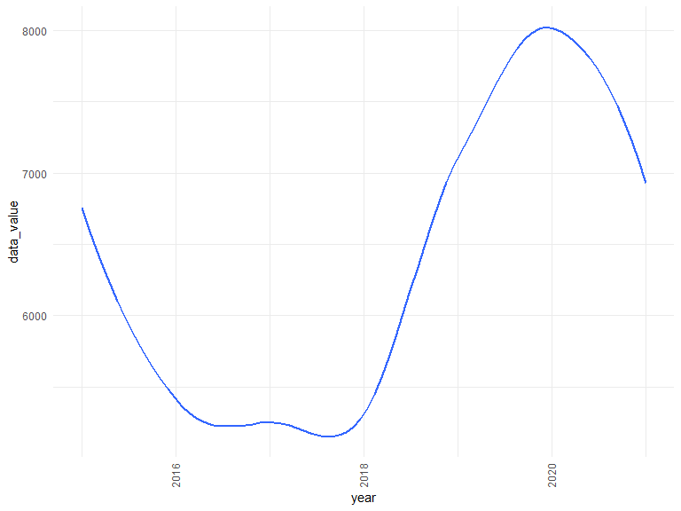

Data Cleaning
================

Load the data

``` r
drug_df = 
  read_csv("data/VSRR_Provisional_Drug_Overdose_Death_Counts.csv") %>% 
  janitor::clean_names()
```

    ## Rows: 42180 Columns: 12

    ## -- Column specification --------------------------------------------------------
    ## Delimiter: ","
    ## chr (8): State, Month, Period, Indicator, Percent Complete, State Name, Foot...
    ## dbl (4): Year, Data Value, Percent Pending Investigation, Predicted Value

    ## 
    ## i Use `spec()` to retrieve the full column specification for this data.
    ## i Specify the column types or set `show_col_types = FALSE` to quiet this message.

sum by states

``` r
state_clean_df = 
  drug_df %>% 
  filter(!(indicator %in% c("Number of Deaths", "Number of Drug Overdose Deaths", "Percent with drugs specified"))) %>% 
  select(state, year, month, indicator, predicted_value) %>% 
  filter(!(state == "US")) %>% 
  mutate(
    predicted_value = replace_na(predicted_value, 0)
  )
```

by years and states

based on predicted value

``` r
ys_df = 
  state_clean_df %>% 
  group_by(year, state) %>% 
  summarize(total_num = sum(predicted_value))
```

    ## `summarise()` has grouped output by 'year'. You can override using the `.groups` argument.

for the whole country

``` r
us_df =   
  state_clean_df %>% 
  filter(state == "US") %>% 
  view()
```

overview by times(not in different indicator)

based on value CDC provided

``` r
overview = 
  drug_df %>% 
  filter(indicator == c("Number of Deaths", "Number of Drug Overdose Deaths")) %>% 
  select("state", "year", "month", "indicator", "data_value") %>% 
  filter(!(state == "US")) %>% 
  group_by(state, year, indicator) %>% 
  summarize(data_value = sum(data_value))
```

    ## `summarise()` has grouped output by 'state', 'year'. You can override using the `.groups` argument.

``` r
overview_death = 
  overview %>% 
  filter(indicator == "Number of Deaths") %>% 
  mutate(
    death_count = min_rank(desc(data_value))
  )

overview_od = 
  overview %>% 
  filter(indicator == "Number of Drug Overdose Deaths")


od_overview_plot = 
  overview_od %>% 
  ggplot(aes(x = state, y = data_value, color = state)) +
  geom_point() +
  facet_grid(~year) +
  theme_set(theme_minimal() + theme(legend.position = "bottom")) +
  theme(axis.text.x = element_text(angle = 90, vjust = 0.4, hjust = 1))
  

##2015 CA, 2016 FL, 2017 OH, 2018 FL, 2020 CA, 2021 CA
```

Trend across year:

``` r
trend_year_plot =
  overview_od %>% 
 ggplot(aes(x = year, y = data_value)) +
  geom_smooth(se = FALSE) +
  theme_set(theme_minimal() + theme(legend.position = "bottom"))  +
  theme(axis.text.x = element_text(angle = 90, vjust = 0.4, hjust = 1))
trend_year_plot
```

    ## `geom_smooth()` using method = 'loess' and formula 'y ~ x'



overview by type of drugs by state

``` r
overview_drug = 
  state_clean_df %>% 
  group_by(state, indicator) %>% 
  summarize(predicted_value = sum(predicted_value))
```

    ## `summarise()` has grouped output by 'state'. You can override using the `.groups` argument.

``` r
drug_overview_plot = 
  overview_drug %>% 
  ggplot(aes(x = indicator, y = predicted_value, color = state)) +
  geom_point() +
  theme_set(theme_minimal() + theme(legend.position = "bottom")) +
  theme(axis.text.x = element_text(angle = 90, vjust = 0.4, hjust = 1))
```

overview by type for US

``` r
overview_drug_us = 
  state_clean_df %>% 
  group_by(indicator) %>% 
  summarize(predicted_value = sum(predicted_value))

drug_overview_us = 
  overview_drug_us %>% 
  ggplot(aes(x = indicator, y = predicted_value)) +
  geom_point() +
  theme_set(theme_minimal() + theme(legend.position = "bottom")) +
  theme(axis.text.x = element_text(angle = 90, vjust = 0.4, hjust = 1))
```
