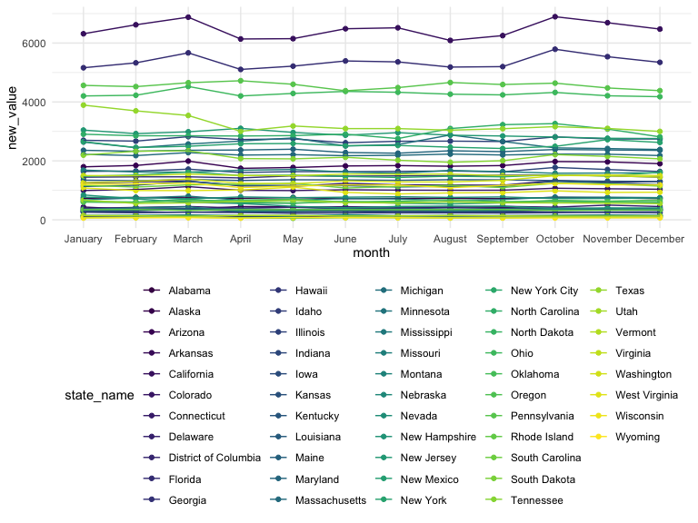

data_cleaning
================
Yuxuan Chen
12/1/2021

Import the libraries

``` r
library(tidyverse)
library(rvest)
library(httr)
```

# data cleaning

**Part I: By state**

We’ve found that instead of having the usual 50 states and Washington
DC, the data set also contains data for the whole US and the City of New
York. We choose to focus on the 51 jurisdictions at first.

``` r
drug_overdose = read_csv("./data/VSRR_Provisional_Drug_Overdose_Death_Counts.csv") %>% 
  janitor::clean_names()

unique(pull(drug_overdose, state))
```

    ##  [1] "AK" "AL" "AR" "AZ" "CA" "CO" "CT" "DC" "DE" "FL" "GA" "HI" "IA" "ID" "IL"
    ## [16] "IN" "KS" "KY" "LA" "MA" "MD" "ME" "MI" "MN" "MO" "MS" "MT" "NC" "ND" "NE"
    ## [31] "NH" "NJ" "NM" "NV" "NY" "OH" "OK" "OR" "PA" "RI" "SC" "SD" "TN" "TX" "US"
    ## [46] "UT" "VA" "VT" "WA" "WI" "WV" "WY" "YC"

``` r
# contains 50 states, Washington DC, whole US, and the City of New York.
```

-   State level:

``` r
state_level = c(state.name[1:8], "District of Columbia", state.name[9:50])
```

``` r
drug_overdose_51 = 
  drug_overdose %>% 
  filter(!(state_name %in% c("New York City", "United States"))) %>% 
  relocate(state_name) %>% 
  mutate(month = factor(month, levels = month.name), # change month and year to factor
         year = factor(year)) %>% 
  arrange(state_name) %>% 
  group_by(state_name, year) %>% 
  mutate(month = sort(month)) # sort by month order

drug_overdose_51
```

    ## # A tibble: 39,825 × 12
    ## # Groups:   state_name, year [357]
    ##    state_name state year  month    period          indicator data_value percent_complete
    ##    <chr>      <chr> <fct> <fct>    <chr>           <chr>          <dbl> <chr>           
    ##  1 Alabama    AL    2015  January  12 month-ending Number o…    50565   100             
    ##  2 Alabama    AL    2015  January  12 month-ending Percent …       49.3 100             
    ##  3 Alabama    AL    2015  January  12 month-ending Number o…      738   100             
    ##  4 Alabama    AL    2015  February 12 month-ending Number o…      736   100             
    ##  5 Alabama    AL    2015  February 12 month-ending Number o…    50930   100             
    ##  6 Alabama    AL    2015  February 12 month-ending Percent …       46.9 100             
    ##  7 Alabama    AL    2015  March    12 month-ending Percent …       49.6 100             
    ##  8 Alabama    AL    2015  March    12 month-ending Number o…      720   100             
    ##  9 Alabama    AL    2015  March    12 month-ending Number o…    50870   100             
    ## 10 Alabama    AL    2015  April    12 month-ending Number o…    50004   100             
    ## # … with 39,815 more rows, and 4 more variables:
    ## #   percent_pending_investigation <dbl>, footnote <chr>, footnote_symbol <chr>,
    ## #   predicted_value <dbl>

-   Since the dataset mostly doesn’t have the death count values for
    specific types of drug overdose, for this dataset, we only choose
    the data_value with indicator of `Number of Deaths`,
    `Percent with drugs specified`, and
    `Number of Drug Overdose Deaths`.

``` r
# (For Plot): 
# percentage of drug overdose deaths over total number of deaths
# percentage of drugs specified (text describe)

drug_overdose_death = 
  drug_overdose_51 %>% 
  select(-c(state, footnote_symbol, percent_complete, period, percent_pending_investigation, predicted_value)) %>% 
  filter(indicator %in% c("Number of Deaths", "Percent with drugs specified", "Number of Drug Overdose Deaths"))
drug_overdose_death
```

    ## # A tibble: 11,475 × 6
    ## # Groups:   state_name, year [357]
    ##    state_name year  month    indicator                      data_value footnote 
    ##    <chr>      <fct> <fct>    <chr>                               <dbl> <chr>    
    ##  1 Alabama    2015  January  Number of Deaths                  50565   Numbers …
    ##  2 Alabama    2015  January  Percent with drugs specified         49.3 Numbers …
    ##  3 Alabama    2015  January  Number of Drug Overdose Deaths      738   Numbers …
    ##  4 Alabama    2015  February Number of Drug Overdose Deaths      736   Numbers …
    ##  5 Alabama    2015  February Number of Deaths                  50930   Numbers …
    ##  6 Alabama    2015  February Percent with drugs specified         46.9 Numbers …
    ##  7 Alabama    2015  March    Percent with drugs specified         49.6 Numbers …
    ##  8 Alabama    2015  March    Number of Drug Overdose Deaths      720   Numbers …
    ##  9 Alabama    2015  March    Number of Deaths                  50870   Numbers …
    ## 10 Alabama    2015  April    Number of Deaths                  50004   Numbers …
    ## # … with 11,465 more rows

-   `Number of Drug Overdose Deaths` is predicted since the
    `Percent with drugs specified` is not 100%.

footnote categorization: I AM STILL NOT SURE OF THIS PART. I JUST KEPT
CREATING DUMMY VARIABLES!!

``` r
#unique(pull(drug_overdose_51, footnote))
drug_overdose_51 = 
  drug_overdose_51 %>%
  mutate(low_data_quality = ifelse(str_detect(footnote, "low data quality"), 1, 0), # data_value not shown, predicted yes?
         suppressed = ifelse(str_detect(footnote, "suppressed"), 1, 0),
         underreported = ifelse(str_detect(footnote, "Underreported"), 1, 0)) %>% 
  relocate(footnote, .after = last_col())
```

**drug categories: letter-number indicators**

Drug overdose deaths are identified using underlying cause-of-death
codes from the Tenth Revision of ICD (ICD–10): X40–X44 (unintentional),
X60–X64 (suicide), X85 (homicide), and Y10–Y14 (undetermined). Drug
overdose deaths involving selected drug categories are identified by
specific multiple cause-of-death codes.

Drug categories presented include: heroin (T40.1); natural opioid
analgesics, including morphine and codeine, and semisynthetic opioids,
including drugs such as oxycodone, hydrocodone, hydromorphone, and
oxymorphone (T40.2); methadone, a synthetic opioid (T40.3); synthetic
opioid analgesics other than methadone, including drugs such as fentanyl
and tramadol (T40.4); cocaine (T40.5); and psychostimulants with abuse
potential, which includes methamphetamine (T43.6). Opioid overdose
deaths are identified by the presence of any of the following MCOD
codes: opium (T40.0); heroin (T40.1); natural opioid analgesics (T40.2);
methadone (T40.3); synthetic opioid analgesics other than methadone
(T40.4); or other and unspecified narcotics (T40.6). This latter
category includes drug overdose deaths where ‘opioid’ is reported
without more specific information to assign a more specific ICD–10 code
(T40.0–T40.4) (3,4). Among deaths with an underlying cause of drug
overdose, the percentage with at least one drug or drug class specified
is defined as that with at least one ICD–10 multiple cause-of-death code
in the range T36–T50.8.

``` r
drug_categories = 
  drug_overdose_51 %>%
  ungroup() %>% 
  select(-c(state, footnote_symbol, percent_complete, period, percent_pending_investigation, footnote, predicted_value)) %>% 
  filter(str_detect(indicator, "T4"))
drug_categories
```

    ## # A tibble: 28,350 × 8
    ##    state_name year  month    indicator    data_value low_data_quality suppressed
    ##    <chr>      <fct> <fct>    <chr>             <dbl>            <dbl>      <dbl>
    ##  1 Alaska     2015  January  Natural, se…         NA                1          0
    ##  2 Alaska     2015  January  Natural & s…         NA                1          0
    ##  3 Alaska     2015  January  Natural & s…         NA                1          0
    ##  4 Alaska     2015  January  Opioids (T4…         NA                1          0
    ##  5 Alaska     2015  January  Cocaine (T4…         NA                1          0
    ##  6 Alaska     2015  January  Synthetic o…         NA                1          0
    ##  7 Alaska     2015  January  Psychostimu…         NA                1          0
    ##  8 Alaska     2015  January  Heroin (T40…         NA                1          0
    ##  9 Alaska     2015  January  Methadone (…         NA                1          1
    ## 10 Alaska     2015  February Synthetic o…         NA                1          0
    ## # … with 28,340 more rows, and 1 more variable: underreported <dbl>

``` r
# missing states' data:
drug_overdose_51 %>% 
  ungroup() %>% 
  select(state_name) %>% 
  unique() %>% 
  filter(!(state_name %in% drug_categories$state_name))
```

    ## # A tibble: 9 × 1
    ##   state_name  
    ##   <chr>       
    ## 1 Alabama     
    ## 2 Arkansas    
    ## 3 Florida     
    ## 4 Idaho       
    ## 5 Louisiana   
    ## 6 Minnesota   
    ## 7 Nebraska    
    ## 8 North Dakota
    ## 9 Pennsylvania

-   missing data in 9 states: Alabama, Arkansas, Florida, Idaho,
    Louisiana, Minnesota, Nebraska, North Dakota, Pennsylvania.

**Part II: counties in New York**

**NEED TO FIND DATA FOR 2019-2021**

``` r
# for consistency between datasets, I only chose the data from 2015 to 2021

# model-based death rate:
predicted_deathrate_bycounty = 
  read_csv("./data/NCHS_-_Drug_Poisoning_Mortality_by_County__United_States.csv") %>% 
  janitor::clean_names() %>% 
  arrange(state) %>% 
  filter(year %in% (2015:2018),
         state %in% "New York")
```

    ## Rows: 50176 Columns: 12

    ## ── Column specification ────────────────────────────────────────────────────────
    ## Delimiter: ","
    ## chr (3): State, County, Urban/Rural Category
    ## dbl (9): FIPS, Year, FIPS State, Population, Model-based Death Rate, Standar...

    ## 
    ## ℹ Use `spec()` to retrieve the full column specification for this data.
    ## ℹ Specify the column types or set `show_col_types = FALSE` to quiet this message.

``` r
predicted_deathrate_bycounty
```

    ## # A tibble: 248 × 12
    ##     fips  year state    fips_state county              population model_based_dea…
    ##    <dbl> <dbl> <chr>         <dbl> <chr>                    <dbl>            <dbl>
    ##  1 36001  2015 New York         36 Albany County, NY       307476             11.4
    ##  2 36001  2016 New York         36 Albany County, NY       307628             11.4
    ##  3 36001  2017 New York         36 Albany County, NY       307717             14.8
    ##  4 36001  2018 New York         36 Albany County, NY       307117             15.4
    ##  5 36003  2015 New York         36 Allegany County, NY      47324             10.9
    ##  6 36003  2016 New York         36 Allegany County, NY      47039             12.3
    ##  7 36003  2017 New York         36 Allegany County, NY      46688             13.8
    ##  8 36003  2018 New York         36 Allegany County, NY      46430             14.9
    ##  9 36005  2015 New York         36 Bronx County, NY       1440726             15.5
    ## 10 36005  2016 New York         36 Bronx County, NY       1445237             22.2
    ## # … with 238 more rows, and 5 more variables: standard_deviation <dbl>,
    ## #   lower_confidence_limit <dbl>, upper_confidence_limit <dbl>,
    ## #   urban_rural_category <chr>, census_division <dbl>

``` r
# Plot by county 
# or combine, plot by state
```

``` r
unique(pull(predicted_deathrate_bycounty, census_division))
```

    ## [1] 2

**Part III: the place that drug overdose happens (death place; injury
place)** “drug_deaths”

**Part IV: OPEN FOR DISCUSSION**

The following is “Completeness of 12-month ending provisional counts of
**drug overdose deaths** relative to final counts from 2019 after six
month lag, by reporting jurisdiction and ending month” from the CDC
website. (check same datasets)

``` r
url = "./data/ok.html"
drug_use_html = 
  read_html(url)  # r has imported the html page

 # we got the completeness data
completeness_51 = 
  drug_use_html %>% 
  html_table()  %>% 
  .[[2]] %>% 
  janitor::clean_names() %>% 
  rename(state_name = reporting_jurisdiction) %>% 
  filter(!(state_name %in% c("New York City", "United States"))) %>% 
  pivot_longer(jan:dec, names_to = "month", values_to = "completeness") %>% 
  mutate(month = month.name[match(str_to_title(month), month.abb)],
         month = factor(month, levels = month.name))
completeness_51 
```

    ## # A tibble: 612 × 3
    ##    state_name month     completeness
    ##    <chr>      <fct>            <dbl>
    ##  1 Alabama    January           95.6
    ##  2 Alabama    February          96.2
    ##  3 Alabama    March             98.9
    ##  4 Alabama    April             96.3
    ##  5 Alabama    May               95.7
    ##  6 Alabama    June              99.5
    ##  7 Alabama    July              98.7
    ##  8 Alabama    August            96.5
    ##  9 Alabama    September         97.3
    ## 10 Alabama    October           98.5
    ## # … with 602 more rows

``` r
# try to write a function to apply the completeness value to number_of_death_51.
data_imputation = function(original, criteria){
  original = original * ((100 - criteria)/100 + 1)
}
a = drug_overdose_death %>% 
  filter(str_detect(indicator, "Drug Overdose Deaths")) %>% 
  mutate(state_name = factor(state_name, levels = state_level)) %>% 
  filter(year == 2019) %>% 
  select(state_name, year, month, data_value) %>% 
  arrange(state_name, month) %>% 
  ungroup() %>% 
  mutate(new_value = map2_dbl(.x = data_value, .y = pull(completeness_51, completeness), ~data_imputation(.x, .y)))

a %>% 
 # filter(state_name %in% "California") %>%   # uncomment this to see the ggplot for each state
  ggplot(aes(y = new_value, x = month, color = state_name)) +
  geom_point() +
  geom_line(aes(group = state_name))
```



-   data for the City of New York are all excluded.
