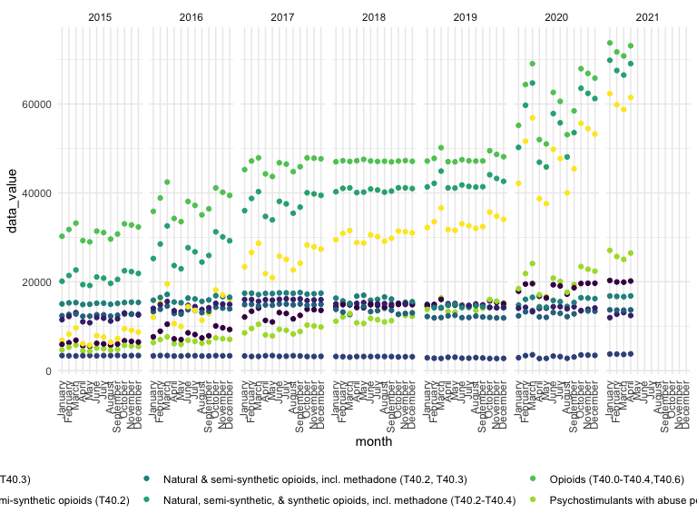
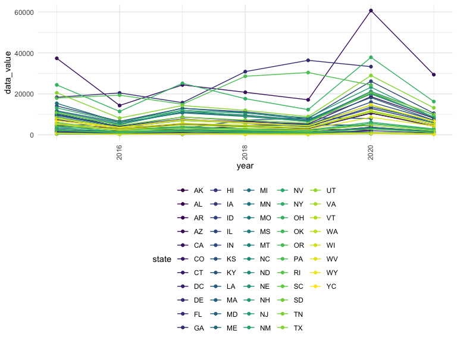
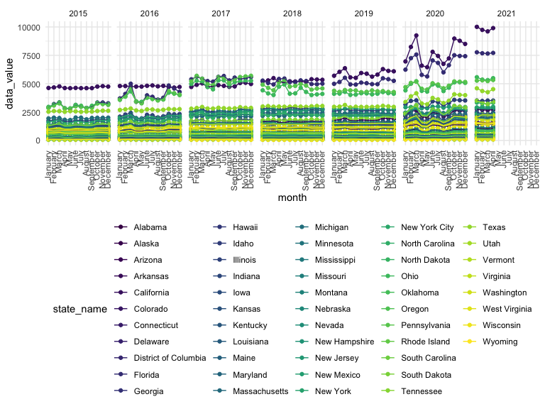
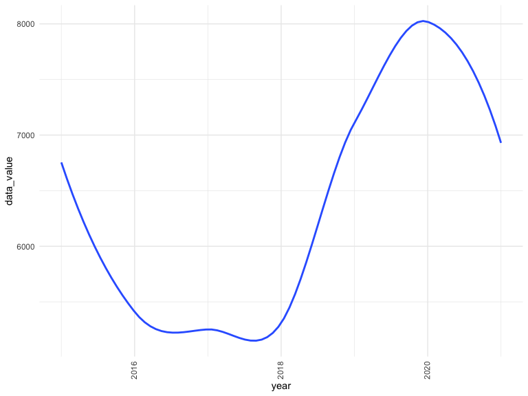

USA dataset
================

## Data cleaning

-   We’ve found that instead of having the usual 50 states, Washington
    DC, and New York City, the data set also contains data for the whole
    US. We choose to focus on the 52 jurisdictions (including the 50
    states, DC, and NYC) at first.

``` r
drug_overdose = read_csv("./data/VSRR_Provisional_Drug_Overdose_Death_Counts.csv") %>% 
  janitor::clean_names()

unique(pull(drug_overdose, state))
```

    ##  [1] "AK" "AL" "AR" "AZ" "CA" "CO" "CT" "DC" "DE" "FL" "GA" "HI" "IA" "ID" "IL"
    ## [16] "IN" "KS" "KY" "LA" "MA" "MD" "ME" "MI" "MN" "MO" "MS" "MT" "NC" "ND" "NE"
    ## [31] "NH" "NJ" "NM" "NV" "NY" "OH" "OK" "OR" "PA" "RI" "SC" "SD" "TN" "TX" "US"
    ## [46] "UT" "VA" "VT" "WA" "WI" "WV" "WY" "YC"

``` r
# contains 50 states, Washington DC, whole US, and the City of New York.
```

-   State level:

``` r
state_level = c(state.name[1:8], "District of Columbia", state.name[9:32],"New York City", state.name[33:50])
```

Tidy data:

``` r
drug_overdose_52 = 
  drug_overdose %>% 
  filter(!(state_name %in% c("United States"))) %>% 
  relocate(state_name) %>% 
  mutate(month = factor(month, levels = month.name), # change month and year to factor
         year = factor(year),
         state_name = factor(state_name, levels = state_level)) %>% 
  arrange(state_name) %>% 
  group_by(state_name, year) %>% 
  mutate(month = sort(month)) # sort by month order
```

-   Since the dataset mostly doesn’t have the death count values for
    specific types of drug overdose, for this dataset, we only choose
    the data\_value with indicator of `Number of Deaths`,
    `Percent with drugs specified`, and
    `Number of Drug Overdose Deaths`.

``` r
drug_overdose_death = 
  drug_overdose_52 %>% 
  select(-c( footnote_symbol, percent_complete, period, percent_pending_investigation, predicted_value)) %>% 
  filter(indicator %in% c("Number of Deaths", "Percent with drugs specified", "Number of Drug Overdose Deaths"))
drug_overdose_death
```

    ## # A tibble: 11,856 x 7
    ## # Groups:   state_name, year [364]
    ##    state_name state year  month    indicator     data_value footnote            
    ##    <fct>      <chr> <fct> <fct>    <chr>              <dbl> <chr>               
    ##  1 Alabama    AL    2015  January  Number of De~    50565   Numbers may differ ~
    ##  2 Alabama    AL    2015  January  Percent with~       49.3 Numbers may differ ~
    ##  3 Alabama    AL    2015  January  Number of Dr~      738   Numbers may differ ~
    ##  4 Alabama    AL    2015  February Percent with~       46.9 Numbers may differ ~
    ##  5 Alabama    AL    2015  February Number of Dr~      736   Numbers may differ ~
    ##  6 Alabama    AL    2015  February Number of De~    50930   Numbers may differ ~
    ##  7 Alabama    AL    2015  March    Number of Dr~      720   Numbers may differ ~
    ##  8 Alabama    AL    2015  March    Number of De~    50870   Numbers may differ ~
    ##  9 Alabama    AL    2015  March    Percent with~       49.6 Numbers may differ ~
    ## 10 Alabama    AL    2015  April    Number of Dr~      723   Numbers may differ ~
    ## # ... with 11,846 more rows

-   `Number of Drug Overdose Deaths` is predicted since the
    `Percent with drugs specified` is not 100%.

footnote categorization:

``` r
#unique(pull(drug_overdose_51, footnote))
drug_overdose_52 = 
  drug_overdose_52 %>%
  mutate(low_data_quality = ifelse(str_detect(footnote, "low data quality"), 1, 0), # data_value not shown, predicted yes?
         suppressed = ifelse(str_detect(footnote, "suppressed"), 1, 0),
         underreported = ifelse(str_detect(footnote, "Underreported"), 1, 0)) %>% 
  relocate(footnote, .after = last_col())
```

## Analysis by drug

``` r
drug_categories = 
  drug_overdose_52 %>%
  ungroup() %>% 
  select(-c(state, footnote_symbol, percent_complete, period, percent_pending_investigation, footnote, predicted_value)) %>% 
  filter(str_detect(indicator, "T4"))
drug_categories
```

    ## # A tibble: 29,412 x 8
    ##    state_name year  month    indicator    data_value low_data_quality suppressed
    ##    <fct>      <fct> <fct>    <chr>             <dbl>            <dbl>      <dbl>
    ##  1 Alaska     2015  January  Natural & s~         NA                1          0
    ##  2 Alaska     2015  January  Natural & s~         NA                1          0
    ##  3 Alaska     2015  January  Natural, se~         NA                1          0
    ##  4 Alaska     2015  January  Synthetic o~         NA                1          0
    ##  5 Alaska     2015  January  Heroin (T40~         NA                1          0
    ##  6 Alaska     2015  January  Methadone (~         NA                1          1
    ##  7 Alaska     2015  January  Opioids (T4~         NA                1          0
    ##  8 Alaska     2015  January  Cocaine (T4~         NA                1          0
    ##  9 Alaska     2015  January  Psychostimu~         NA                1          0
    ## 10 Alaska     2015  February Natural & s~         NA                1          0
    ## # ... with 29,402 more rows, and 1 more variable: underreported <dbl>

``` r
# missing states' data:
miss_states = 
  drug_overdose_52 %>% 
  ungroup() %>% 
  select(state_name) %>%
  unique() %>% 
  filter(!(state_name %in% drug_categories$state_name))
miss_states
```

    ## # A tibble: 9 x 1
    ##   state_name  
    ##   <fct>       
    ## 1 Alabama     
    ## 2 Arkansas    
    ## 3 Florida     
    ## 4 Idaho       
    ## 5 Louisiana   
    ## 6 Minnesota   
    ## 7 Nebraska    
    ## 8 North Dakota
    ## 9 Pennsylvania

``` r
drug_type_plot = 
  drug_overdose %>% 
  filter(state %in% c("US")) %>% 
  filter(!(indicator %in% c("Number of Deaths", "Number of Drug Overdose Deaths", "Percent with drugs specified")))%>% 
  relocate(state) %>% 
  mutate(month = factor(month, levels = month.name), # change month and year to factor
         year = factor(year)) %>% 
  arrange(state) %>% 
  group_by(state, year) %>% 
  mutate(month = sort(month)) %>% 
  ggplot(aes(x = month, y = data_value,color = indicator)) +
  geom_point()+
  facet_grid(~year)+
  theme(axis.text.x = element_text(angle = 90, vjust = 0.4, hjust = 1))
drug_type_plot
```


- missing data in 9 states: Alabama, Arkansas, Florida, Idaho,
Louisiana, Minnesota, Nebraska, North Dakota, Pennsylvania.

## By year/month:

which states have highest death in each year option1: maybe this one
better

``` r
overview_year = 
  drug_overdose %>% 
  filter(indicator == c("Number of Deaths", "Number of Drug Overdose Deaths")) %>% 
  select("state", "year", "month", "indicator", "data_value") %>% 
  filter(!(state == "US")) %>% 
  filter(str_detect(indicator, "Drug Overdose Deaths")) %>% 
  group_by(state, year, indicator) %>% 
  summarize(data_value = sum(data_value)) 
```

    ## `summarise()` has grouped output by 'state', 'year'. You can override using the `.groups` argument.

``` r
overview_year_plot = 
  overview_year %>% 
   ggplot(aes(x = year, y = data_value, color = state)) +
  geom_point() +
  geom_line()+
  theme_set(theme_minimal() + theme(legend.position = "bottom")) +
  theme(axis.text.x = element_text(angle = 90, vjust = 0.4, hjust = 1))
overview_year_plot
```



option2:

``` r
drug_overdose_52  %>% 
  filter(str_detect(indicator, "Drug Overdose Deaths")) %>% 
  mutate(state_name = factor(state_name, levels = state_level)) %>% 
  select(state_name, year, month, data_value) %>% 
  arrange(state_name, month) %>% 
  ungroup() %>% 
  ggplot(aes(y = data_value, x = month, color = state_name)) +
  geom_point() +
  geom_line(aes(group = state_name))+
  facet_grid(~year)+
   theme_set(theme_minimal() + theme(legend.position = "bottom")) +
  theme(axis.text.x = element_text(angle = 90, vjust = 0.4, hjust = 1))
```



## Trend across year:

``` r
trend_year_plot =
  drug_overdose %>% 
  filter(indicator == c("Number of Deaths", "Number of Drug Overdose Deaths")) %>% 
  select("state", "year", "month", "indicator", "data_value") %>% 
  filter(!(state == "US")) %>% 
  group_by(state, year, indicator) %>% 
  summarize(data_value = sum(data_value)) %>% 
  filter(str_detect(indicator, "Drug Overdose Deaths")) %>% 
 ggplot(aes(x = year, y = data_value)) +
  geom_smooth(se = FALSE) +
  theme_set(theme_minimal() + theme(legend.position = "bottom"))  +
  theme(axis.text.x = element_text(angle = 90, vjust = 0.4, hjust = 1))
```

    ## `summarise()` has grouped output by 'state', 'year'. You can override using the `.groups` argument.

``` r
trend_year_plot
```

    ## `geom_smooth()` using method = 'loess' and formula 'y ~ x'


